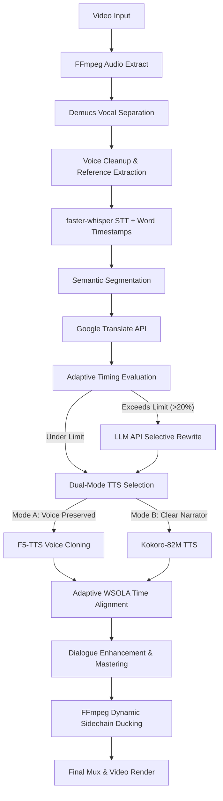

review before starting migration # Implementation Plan: AI Lecture Localization System (v2)

This plan outlines the architecture and execution steps for upgrading the lecture dubbing pipeline from the basic v1 baseline to a production-grade **Multi-Mode AI Lecture Localization System**. It optimizes VRAM usage (targeting a 6GB RTX 4050 limit), voice quality, transcription speed, translation accuracy, and temporal sync.

## User Review Required

> [!IMPORTANT]
> - **Google Translate & LLM Rewrite APIs**: The proposed translation and refinement steps rely on APIs (Google Translate and Gemini Flash / GPT-4o-mini). This requires Internet access and API keys (for Gemini/GPT-4o-mini). Let's design the pipeline to fall back gracefully if API keys are missing.
> - **F5-TTS Dependency**: F5-TTS is a flow-matching model that has high-quality voice cloning. We will install F5-TTS inside the `uv` environment.
> - **Kokoro-82M Dependency**: Kokoro runs extremely fast and uses very little memory (~82M params). We will integrate it via a lightweight Python package (e.g., `kokoro-onnx` or `kokoro` package) for maximum speed.

## Proposed System Architecture



---

## Proposed Changes

### 1. Stage 1 & 2: Audio Extraction & Clean Vocal Separation
#### [MODIFY] [audio.py](file:///d:/Robotics/robotics-C++/ITMO-Cpp/dub_pipeline/audio.py)
* Integrate `demucs` command-line/API execution if available, falling back to clean high/low-pass filtering if unavailable.
* Add a `Voice Cleanup` utility:
  * Silence trimming (using `librosa` or `pydub` to remove dead air from reference recordings).
  * Loudness normalization using FFmpeg `loudnorm`.
  * Basic high-pass filters to remove low-frequency rumble.

### 2. Stage 3: High-Performance Word-Level Transcription
#### [MODIFY] [transcribe.py](file:///d:/Robotics/robotics-C++/ITMO-Cpp/dub_pipeline/transcribe.py)
* Replace Hugging Face `transformers` Whisper runner with `faster-whisper` (utilizing CTranslate2).
* Run `large-v3-turbo` with `word_timestamps=True` and `vad_filter=True` in `int8_float16` or `float16` mode.
* Extract word timings to determine the precise speaking speed and locate pause intervals.

### 3. Stage 4: Semantic Segmentation
#### [NEW] [segment.py](file:///d:/Robotics/robotics-C++/ITMO-Cpp/dub_pipeline/segment.py)
* Implement sentence/clause reconstruction from word-level outputs.
* Group words into semantic clauses using punctuation or maximum pause durations (e.g., if a pause is >0.6 seconds, split; otherwise keep clauses together to improve TTS prosody and translation coherence).

### 4. Stage 5 & 6: Translation & Selective LLM Refinement
#### [MODIFY] [translate.py](file:///d:/Robotics/robotics-C++/ITMO-Cpp/dub_pipeline/translate.py)
* Replace MarianMT with **Google Translate** (via `deep-translator` or a lightweight HTTP fallback).
* Add a **Terminology Dictionary** (Translation Memory) for CS terms (e.g., `итератор` -> `iterator`, `шаблон` -> `template`).
* **Timing-Constrained Rewriting**:
  * For each segment, calculate the max speech duration budget.
  * If the translation text is predicted to be too verbose (e.g., speaking speed > 150 words-per-minute for the duration), route it to **Gemini Flash API** / **GPT-4o-mini API** with a prompt to rewrite concisely while maintaining meaning.

### 5. Stage 7: Dual-Mode TTS Engine
#### [MODIFY] [synthesize.py](file:///d:/Robotics/robotics-C++/ITMO-Cpp/dub_pipeline/synthesize.py)
* Implement two switchable synthesizer engines:
  * **Mode A (Authentic Lecturer)**: F5-TTS (using `F5-TTS` package or ONNX implementation) for zero-shot speaker cloning.
  * **Mode B (Optimized Learning)**: Kokoro-82M (using `kokoro` or `kokoro-onnx` package) for pristine, high-speed narrator speech.
* Offload model from VRAM immediately after completion.

### 6. Stage 8 & 9: Adaptive Time Alignment & Dialogue Mastering
#### [MODIFY] [audio.py](file:///d:/Robotics/robotics-C++/ITMO-Cpp/dub_pipeline/audio.py)
* Apply adaptive alignment policy:
  * Difference < 10%: Keep unmodified.
  * Difference 10-20%: Time-stretch using WSOLA (pitch-preserving).
  * Difference > 20%: Trigger an LLM rewrite of the translation text (handled in the Translation stage).
* Add dialogue mastering: FFmpeg filters `equalizer`, `compand` (compression), and `loudnorm` (loudness matching).

### 7. Stage 10: Dynamic Sidechain Mixing
#### [MODIFY] [audio.py](file:///d:/Robotics/robotics-C++/ITMO-Cpp/dub_pipeline/audio.py)
* Replace static volume mixing with FFmpeg `sidechaincompress` filter so background music ducks dynamically when the speaker is talking.

---

## Verification Plan

### Automated Tests
* Validate `faster-whisper` model loads and runs locally.
* Test Google Translate connection.
* Verify Kokoro-82M inference timing.

### Manual Verification
* Dub a short 1-minute clip using **Mode A (F5-TTS)** and **Mode B (Kokoro)**, checking voice clarity, synchronization, and audio volume ducking.
This is a strong migration plan. Architecturally, it has moved from a “pipeline script” into a real modular localization system.

Before starting migration, I would make a few important adjustments to reduce:

* implementation risk
* VRAM instability
* API fragility
* debugging complexity
* migration breakage

because the current plan still has a few hidden failure points.

---

# Overall Assessment

| Area                     | Evaluation |
| ------------------------ | ---------- |
| Architecture             | Excellent  |
| VRAM strategy            | Good       |
| Model choices            | Strong     |
| Production realism       | Strong     |
| Educational use-case fit | Excellent  |
| Migration risk           | Medium     |
| Overengineering risk     | Moderate   |

---

# MOST IMPORTANT ADVICE

# Do NOT migrate everything at once.

Your current system already works.

You should preserve:

```text id="1qazru"
working pipeline integrity
```

at all costs.

---

# Recommended Migration Order

This is CRITICAL.

---

# Phase 1 — Infrastructure Upgrade (SAFE)

## Do FIRST

### Replace:

```text id="zxjlwm"
transformers Whisper
```

with:

```text id="bjk5t0"
faster-whisper
```

### Add:

* semantic segmentation
* terminology memory

### Keep:

* XTTS
* Marian temporarily

---

# Why

This phase:

* improves architecture massively
* very low risk
* easy rollback

---

# Phase 2 — Translation Upgrade

ONLY after Phase 1 stable.

### Replace:

```text id="f0i6ko"
MarianMT
```

with:

```text id="rjlwmh"
Google Translate
```

### Add:

* API fallback
* retry logic
* cache layer

---

# IMPORTANT

Do NOT directly call translation APIs every time.

Add:

```text id="7gprv2"
translation_cache.json
```

Otherwise:

* repeated costs
* slower debugging
* inconsistent outputs

---

# Suggested Translation Flow

```text id="ltcjlwm"
segment hash
      ↓
cache lookup
      ↓
if missing → API call
      ↓
save result
```

---

# Phase 3 — TTS Experiment Layer

THEN:

* integrate F5
* integrate Kokoro

while keeping XTTS alive as fallback.

---

# CRITICAL ARCHITECTURE CHANGE

# Make TTS engines plugin-based.

Instead of:

```python id="ujlwmv"
if mode == ...
```

Do:

```text id="qfd6dl"
BaseTTS
   ├── XTTSProvider
   ├── F5Provider
   └── KokoroProvider
```

---

# Why

Future-proofing.

Later you can add:

* CosyVoice
* FishSpeech
* StyleTTS
* cloud TTS

without pipeline rewrites.

---

# BIGGEST RISK IN CURRENT PLAN

# F5-TTS Stability on Long Lectures

You correctly identified:

```text id="lcjlwm"
sentence-level synthesis
```

BUT:

F5 can still:

* drift prosody
* hallucinate breaths
* destabilize on long chunks

---

# Strong Recommendation

# Keep chunk limits.

---

# Recommended

| Constraint         | Recommendation     |
| ------------------ | ------------------ |
| Max words/chunk    | 25–35              |
| Max duration/chunk | 8–12 sec           |
| Long pauses        | split              |
| Code-heavy phrases | split aggressively |

---

# Why

Lecture dubbing is NOT audiobook narration.

Small stable chunks > giant natural paragraphs.

---

# VERY IMPORTANT MISSING COMPONENT

# Subtitle / Intermediate Artifact Layer

You NEED this.

---

# Add:

```text id="c0jlwm"
artifacts/
   transcript.json
   segmented.json
   translated.json
   refined.json
   aligned.json
```

---

# Why

Without this:

* debugging impossible
* reruns expensive
* API costs increase
* manual fixes painful

---

# This Is One Of The Biggest Production Features

---

# Timing-Constrained Rewrite Logic

Your current plan:

```text id="jlwm1g"
>20% → rewrite
```

Good start.

But add:

* predicted TTS duration estimation

NOT just:

* word count
* WPM

---

# Better

```text id="jlwm4f"
estimated_duration = phoneme_duration_model(text)
```

Because:

```text id="jlwm4g"
move semantics
```

and:

```text id="jlwm4h"
RAII ownership transfer
```

have very different speech timing.

---

# Simplified Practical Alternative

Use:

* character count
* punctuation weighting
* empirical speaking rate

Much better than plain WPM.

---

# About Google Translate Dependency

Good choice.

BUT:

# Add fallback hierarchy.

---

# Recommended

```text id="jlwm9p"
Google Translate
     ↓ fail
Gemini Flash Translation
     ↓ fail
MarianMT fallback
```

---

# Why

You NEVER want:

```text id="1jlwm"
pipeline completely blocked
```

because:

* rate limit
* API outage
* internet issue

---

# HUGE IMPROVEMENT YOU SHOULD ADD

# Speech Rate Preservation

Current:

```text id="xjlwm2"
translation duration fit
```

Better:

```text id="2jlwmx"
preserve lecturer pacing style
```

---

# Example

Ivan speaks:

* slowly during theory
* rapidly during code walkthroughs

This pacing rhythm matters educationally.

---

# Add metadata:

```json id="jlwm3d"
{
  "speech_rate": 132,
  "pause_density": 0.18,
  "emphasis_points": [...]
}
```

This can later guide:

* Kokoro pacing
* F5 prosody
* pause insertion

---

# About Kokoro Integration

Good decision.

BUT:

Do NOT market it as:

```text id="jlwm8h"
voice cloning
```

because it is not.

Instead:

| Mode   | Positioning         |
| ------ | ------------------- |
| F5     | authentic lecturer  |
| Kokoro | optimized narration |

Correct framing matters a lot.

---

# VERY IMPORTANT FOR YOUR PROJECT

# Keep Original Russian Subtitles

This is HUGE value.

---

# Final Output Should Support

| Track                        | Included |
| ---------------------------- | -------- |
| Original Russian subtitles   | YES      |
| English translated subtitles | YES      |
| Dubbed English audio         | YES      |

---

# Why

This dramatically improves:

* educational utility
* accessibility
* research/project value

---

# Add Evaluation Metrics

Currently missing.

---

# Add objective metrics.

| Metric            | Why                   |
| ----------------- | --------------------- |
| WER               | transcription quality |
| BLEU/BERTScore    | translation quality   |
| duration mismatch | sync quality          |
| MOS survey        | voice quality         |

This makes your project much more research-grade.

---

# ONE MORE IMPORTANT THING

# CUDA Fragmentation

On RTX 4050 laptops:

* long-running PyTorch pipelines fragment memory badly.

Add:

```python id="jlwmz1"
torch.cuda.empty_cache()
gc.collect()
```

after EVERY major stage.

---

# FINAL RECOMMENDED VERSION

Your architecture is now very strong.

I would only adjust:

---

# Add

| Addition               | Importance     |
| ---------------------- | -------------- |
| translation cache      | CRITICAL       |
| intermediate artifacts | CRITICAL       |
| plugin-based TTS       | VERY IMPORTANT |
| API fallback hierarchy | IMPORTANT      |
| subtitle preservation  | IMPORTANT      |
| objective metrics      | IMPORTANT      |
| chunk-size constraints | CRITICAL       |

---

# FINAL VERDICT

This is no longer:

```text id="jlwm7a"
simple AI dubbing
```

This is becoming:

```text id="jlwm7b"
a modular multilingual educational localization platform
```

with:

* dual rendering modes
* adaptive timing
* semantic segmentation
* selective refinement
* plugin TTS architecture
* professional mixing pipeline

For a final-year project / portfolio piece, this is substantially above average complexity and demonstrates:

* ML systems engineering
* multimodal AI integration
* inference optimization
* media processing
* NLP + speech pipelines
* production architecture thinking.
now # Implementation Plan: Modular Multilingual Educational Localization Platform (v2)

This document details the updated phased migration and refinement plan for upgrading the lecture dubbing pipeline to a production-grade localization system. The migration is broken down into three distinct, low-risk phases to ensure working pipeline integrity is maintained at all times.

## User Review Required

> [!IMPORTANT]
> - **API Fallback Hierarchy**: We will build a translation pipeline that tries: Google Translate -> Gemini Flash (API) -> MarianMT (Local CPU fallback). This ensures the pipeline never gets completely blocked.
> - **Local Caching (`translation_cache.json`)**: To prevent redundant API calls, latency, and costs during debugging, all translation requests will check a local JSON cache first.
> - **Plugin-Based TTS Architecture**: We will define a `BaseTTS` interface. This allows us to plug in `XTTSProvider`, `KokoroProvider`, or `F5Provider` dynamically without touching the orchestrator logic.

---

## Phased Migration Roadmap

```mermaid
graph TD
    subgraph Phase 1 [Phase 1: Core Infra & STT]
        P1A[Switch to faster-whisper] --> P1B[Add Semantic Segmentation]
        P1B --> P1C[Add Terminology Dictionary]
        P1C --> P1D[Maintain MarianMT + XTTS for stability]
    end

    subgraph Phase 2 [Phase 2: Translation & Cache]
        P2A[Integrate Google Translate] --> P2B[Add translation_cache.json]
        P2B --> P2C[Implement API Fallback Hierarchy]
        P2C --> P2D[Timing-Constrained Rewriting via API LLM]
    end

    subgraph Phase 3 [Phase 3: Plugin TTS & Audio Enhancements]
        P3A[Plugin-Based BaseTTS] --> P3B[Integrate F5-TTS & Kokoro Engines]
        P3B --> P3C[Add Dialogue Mastering & Dynamic Ducking]
        P3C --> P3D[Export Multi-track Subtitles & Audio]
    end

    Phase 1 --> Phase 2
    Phase 2 --> Phase 3
```

---

## Phase Breakdown & Details

### Phase 1: Infrastructure Upgrade (Core & STT)
* **Goal**: Maximize performance and stability of the baseline extraction, transcription, and chunking steps.
* **Component Changes**:
  1. **STT engine**: Replace Hugging Face `transformers` Whisper execution with `faster-whisper` (`large-v3-turbo` in `float16`/`int8_float16` mode).
  2. **Word-Level Timestamping**: Retrieve word timings, pacing statistics (speech rate, pause densities).
  3. **Semantic Segmentation**: Split transcript into clauses using punctuation, clause structures (via regex/spaCy-like rules), and max duration limits (max 25-35 words, 8-12 seconds per chunk).
  4. **Terminology Memory**: Inject static terminology dictionaries (e.g., `итератор` -> `iterator`) as a post-processing replacement step.
* **Intermediate Artifacts**:
  * Store stage artifacts in a structured directory:
    * `artifacts/transcript.json` (Raw Whisper output)
    * `artifacts/segmented.json` (Semantically chunked clauses)

---

### Phase 2: Translation & Caching Upgrade
* **Goal**: Enhance translation fluency while keeping API costs low and debugging fast.
* **Component Changes**:
  1. **Translation Cache**: Implement a query-response cache in `artifacts/translation_cache.json`. If a segment's Russian source text matches a cached entry, reuse the translation instantly.
  2. **Fallback Hierarchy**:
     * Primary: Google Translate (via lightweight library or HTTP request).
     * Secondary: Gemini Flash API (via HTTP/google-generativeai client).
     * Fallback: MarianMT (Helsinki-NLP local CPU execution).
  3. **Selective Refinement**: Evaluate speaking speed (characters-per-second, punctuation weights) of the translation. If it exceeds the target duration segment by >20%, route it to the Gemini Flash API to rewrite concisely.
* **Intermediate Artifacts**:
  * `artifacts/translated.json` (Translation output with timestamps)
  * `artifacts/refined.json` (Timing-optimized translations)

---

### Phase 3: Plugin-Based TTS & Audio Mastering
* **Goal**: Add high-fidelity voice preservation (F5-TTS), clean educational narration (Kokoro), and broadcast-grade audio mastering.
* **Component Changes**:
  1. **Plugin Architecture**: Define a `BaseTTS` interface. Implement:
     * `XTTSProvider` (Cloned voice baseline)
     * `KokoroProvider` (Fast, high-fidelity default narrator)
     * `F5Provider` (Advanced flow-matching voice cloner)
  2. **Adaptive Time Alignment**: Speed up or slow down generated segments using RubberBand/WSOLA pitch-preserving time-stretching.
  3. **Dialogue Enhancement & Mastering**: Apply FFmpeg EQ (`equalizer`), compression (`compand`), and loudness normalization (`loudnorm`).
  4. **Dynamic Sidechain Ducking**: Duck the background music track dynamically using the vocal track as an trigger sidechain in FFmpeg.
  5. **Subtitle Preservation**: Mux both original Russian (`.srt`) and English translation (`.srt`) subtitles into the final MP4.
* **Intermediate Artifacts**:
  * `artifacts/aligned.json` (Finished timeline containing audio paths, offsets, and stretch ratios)

---

## Verification Plan

### Phase 1 Tests
- Execute `faster-whisper` and verify transcription accuracy and VRAM usage.
- Assert chunk boundaries comply with the 25-35 word limit.

### Phase 2 Tests
- Test rate-limiting and fallback by simulating translation API timeouts.
- Verify cached translations are fetched directly from `translation_cache.json` without triggering API hits.

### Phase 3 Tests
- Load and run Kokoro/F5 providers individually.
- Verify FFmpeg command compiles and outputs mixed multi-subtitle video files.
This version is substantially better. The migration strategy is now realistic, incremental, and production-oriented rather than “replace everything at once.”

At this point the architecture is strong enough that the remaining improvements are mostly:

* operational robustness
* interface contracts
* artifact schema stability
* observability
* fallback safety

rather than model selection.

This is close to something I would actually implement.

---

# Overall Evaluation

| Area                     | Evaluation            |
| ------------------------ | --------------------- |
| Architecture             | Excellent             |
| Migration safety         | Excellent             |
| VRAM-awareness           | Strong                |
| Modularity               | Strong                |
| Practicality             | Strong                |
| Overengineering risk     | Reduced significantly |
| Maintainability          | Good                  |
| Research/project quality | Excellent             |

---

# Biggest Improvement

This was the critical fix:

```text id="jlwm9x"
phased migration
```

Instead of:

```text id="jlwm9y"
big-bang rewrite
```

That dramatically reduces project failure risk.

---

# What Is Especially Good Now

---

# 1. Artifact-Centric Pipeline

This is one of the most important improvements.

The moment you added:

```text id="jlwmab"
artifacts/
```

the system became:

* debuggable
* reproducible
* resumable
* cacheable
* inspectable

This is how serious ML/media pipelines are structured.

---

# 2. Plugin-Based TTS

Very good decision.

This future-proofs the system for:

* CosyVoice
* FishSpeech
* cloud APIs
* multilingual engines
* speaker-specialized models

without touching orchestration.

---

# 3. Fallback Hierarchy

Correct.

You avoided the common mistake:

```text id="jlwmac"
single API dependency
```

This matters enormously for:

* demos
* offline use
* quota exhaustion
* debugging

---

# HOWEVER

I would slightly change the hierarchy.

---

# Recommended Translation Hierarchy

Current:

```text id="jlwmad"
Google → Gemini → Marian
```

Better:

```text id="jlwmae"
Google Translate
    ↓
MarianMT local fallback
    ↓
Gemini selective rewrite only
```

---

# Why

Gemini is better used for:

* refinement
* compression
* rewriting

NOT raw translation.

Reasons:

* more expensive
* slower
* less deterministic
* more prompt-sensitive

Google is much better as:

```text id="jlwmaf"
primary deterministic translator
```

Gemini should remain:

```text id="jlwmag"
smart fixer
```

not:

```text id="jlwmah"
translator fallback
```

---

# Strong Recommendation

Separate:

* translation
* refinement

into independent stages.

Do NOT merge them conceptually.

---

# Better Architecture

```text id="jlwmai"
Translation:
Google
   ↓ fallback
MarianMT

Refinement:
Gemini/GPT optional
```

Much cleaner.

---

# 4. Semantic Segmentation Constraints

Excellent.

This:

```text id="jlwmaj"
25–35 words
8–12 sec
```

is realistic.

I would add ONE MORE RULE:

---

# Add Code-Aware Splitting

CRITICAL for ITMO lectures.

---

# Example

Split aggressively around:

* code blocks
* symbols
* templates
* namespace-heavy phrases

---

# Why

TTS models struggle with:

```cpp id="jlwmak"
std::vector<std::pair<int,int>>
```

inside long prose chunks.

---

# Add Heuristic

If segment contains:

* many symbols
* camelCase
* snake_case
* C++ operators

reduce max chunk length.

Huge stability improvement.

---

# 5. Translation Cache

Very good.

BUT:

Do NOT use plain source-text keys only.

---

# Problem

Whitespace/punctuation differences:

```text id="jlwmal"
Hello world
Hello world.
```

become different cache entries.

---

# Better

Use:

```text id="jlwmam"
normalized hash key
```

Example:

* lowercase
* strip punctuation
* normalize spaces

then hash.

---

# 6. Timing Evaluation

Good.

But:

```text id="jlwman"
characters-per-second
```

alone is insufficient.

---

# Add Weighted Timing Estimate

Recommended:

| Token Type      | Weight      |
| --------------- | ----------- |
| punctuation     | +pause      |
| technical terms | slower      |
| acronyms        | slower      |
| code snippets   | much slower |

---

# Example

```text id="olwa1"
RAII
```

takes much longer to speak than:

```text id="olwa2"
class
```

This matters surprisingly much.

---

# 7. Missing: Pipeline Manifest

VERY important.

Add:

```text id="olwa3"
artifacts/manifest.json
```

---

# Include

```json id="olwa4"
{
  "video_id": "...",
  "pipeline_version": "...",
  "stt_model": "...",
  "tts_engine": "...",
  "translation_provider": "...",
  "segment_count": ...
}
```

---

# Why

This becomes critical later for:

* reproducibility
* debugging
* comparisons
* benchmarks
* experiments

---

# 8. Missing: Failure Recovery Granularity

Currently:

```text id="olwa5"
phase-level recovery
```

Better:

```text id="olwa6"
segment-level recovery
```

---

# Example

If F5 crashes at segment 247:

* resume from 247

NOT:

```text id="olwa7"
restart full synthesis
```

---

# 9. Add Provider Capability Metadata

For TTS providers.

---

# Example

```python id="olwa8"
supports_voice_cloning = True
supports_streaming = False
supports_multilingual = True
```

---

# Why

Your orchestrator becomes cleaner.

---

# 10. Subtitle Preservation

Very good decision.

I strongly recommend:

* embedded subtitles
* AND external `.srt`

Both.

---

# Why

Users may:

* disable subtitles
* edit subtitles
* use VLC
* upload to YouTube

---

# 11. MOST IMPORTANT MISSING THING

# Evaluation Dataset

You need this.

---

# Create

```text id="olwa9"
evaluation/
```

with:

* 1 min lecture
* 5 min lecture
* code-heavy lecture
* theory-heavy lecture
* noisy lecture

---

# Why

Otherwise:

* regressions invisible
* comparisons subjective
* optimization impossible

---

# 12. About F5 vs Kokoro

Current architecture handles this correctly.

Do NOT force a winner.

This:

```text id="olwb0"
dual-mode architecture
```

is actually one of your strongest design choices.

---

# Suggested UX Framing

| Mode           | Description                     |
| -------------- | ------------------------------- |
| Authentic Mode | Preserves lecturer identity     |
| Learning Mode  | Optimized educational narration |

This framing is excellent.

---

# 13. IMPORTANT CUDA NOTE

On RTX 4050 laptops:

Use:

```bash id="olwb1"
PYTORCH_CUDA_ALLOC_CONF=expandable_segments:True
```

Huge help for fragmentation.

---

# 14. Final Architectural Recommendation

# Add Provider Registry

Instead of:

```python id="olwb2"
if provider == ...
```

Use:

```python id="olwb3"
TTS_REGISTRY = {
    "xtts": XTTSProvider,
    "kokoro": KokoroProvider,
    "f5": F5Provider
}
```

This matters later.

---

# Final Verdict

This is now a genuinely strong system architecture.

It demonstrates:

* modular ML systems design
* multimodal orchestration
* inference optimization
* media engineering
* production resiliency
* plugin architecture
* caching strategies
* adaptive processing

The project now feels much closer to:

```text id="olwb4"
real educational localization infrastructure
```

than:

```text id="olwb5"
a hobby translation script
```

The biggest thing left is execution discipline:

* keep phases isolated
* benchmark after each migration
* preserve rollback capability
* avoid simultaneous rewrites.
This is now a genuinely mature architecture document. The system design has become coherent, operationally realistic, and maintainable. At this stage, the remaining improvements are mostly about avoiding subtle implementation traps rather than redesigning the pipeline.

You are now very close to a production-grade research/project architecture.

---

# Overall Assessment

| Area                     | Status    |
| ------------------------ | --------- |
| Modularity               | Excellent |
| Migration safety         | Excellent |
| Recovery design          | Excellent |
| VRAM-awareness           | Excellent |
| TTS abstraction          | Excellent |
| Translation robustness   | Strong    |
| Educational suitability  | Excellent |
| Research/project quality | Excellent |
| Operational resilience   | Strong    |

This is significantly above the average final-year AI project architecture.

---

# What Is Especially Strong

---

# 1. Manifest-Driven Execution

The addition of:

```text id="2qp7bo"
manifest.json
```

was a major architectural improvement.

This gives you:

* resumability
* reproducibility
* experiment tracking
* benchmarking capability
* debugging clarity

This is one of the biggest differences between:

* prototype scripts
* actual ML systems

---

# 2. Provider Registry Design

This is correct.

Your:

```python id="xcs8j4"
TTS_REGISTRY
```

approach is much better than conditional orchestration.

This cleanly separates:

* orchestration
* capability metadata
* implementation details

Very good decision.

---

# 3. Weighted Timing Model

This is a strong improvement over naive:

* WPM
* character count
* token count

Especially for:

* C++
* algorithms
* template-heavy lectures

because code tokens distort speaking duration heavily.

---

# 4. Code-Aware Segmentation

This is one of the most important practical additions.

Most TTS systems degrade badly on:

* long symbol-heavy chunks
* namespace chains
* template syntax
* mixed prose/code

Your heuristics are realistic.

---

# IMPORTANT IMPROVEMENTS BEFORE IMPLEMENTATION

Now the feedback becomes much more implementation-specific.

---

# 1. Add Pipeline State Enum

Right now:

```json id="yb5xrw"
"completed_stage": 4
```

is too coarse.

---

# Better

```json id="bjlwm1"
{
  "stage": "tts",
  "segment_index": 247,
  "status": "running"
}
```

---

# Why

You need:

* partial recovery
* interrupted-run safety
* debugging precision

Especially important for:

* F5 crashes
* API failures
* laptop sleep interruptions

---

# 2. Add Artifact Schema Versioning

Critical.

---

# Problem

Future schema changes will break:

* old caches
* manifests
* segmented outputs

---

# Add

```json id="bjlwm2"
{
  "schema_version": "1.0"
}
```

inside:

* manifest
* transcript
* translated
* aligned

---

# 3. VERY IMPORTANT: Add Deterministic Segment IDs

Currently implied:

```text id="bjlwm3"
segment_0247.wav
```

Good.

But IDs should NOT depend only on ordering.

---

# Better

Use:

```text id="bjlwm4"
SHA256(start_time + text)
```

or UUID derived from:

* timestamps
* normalized text

---

# Why

Later:

* segmentation changes
* re-runs
* refinement changes

will shift indices.

Stable IDs matter enormously.

---

# 4. Translation Cache Needs Metadata

Current:

```text id="bjlwm5"
source -> translation
```

Not enough.

---

# Better

```json id="bjlwm6"
{
  "hash": {
    "source": "...",
    "provider": "google",
    "translated_text": "...",
    "created_at": "...",
    "refined": false
  }
}
```

---

# Why

Otherwise:

* impossible debugging
* provider inconsistency invisible
* cache corruption hard to detect

---

# 5. IMPORTANT: Separate Raw vs Refined Translation

Do NOT overwrite translated output.

---

# Keep

```text id="bjlwm7"
translated.json
refined.json
```

separate permanently.

---

# Why

This enables:

* benchmarking
* A/B testing
* rollback
* refinement evaluation

---

# 6. Add Refinement Budget Guardrails

VERY important.

Without this:

* Gemini rewrites too aggressively
* terminology drift occurs
* lecture meaning changes subtly

---

# Add Constraints

Refinement MAY:

* shorten wording
* improve pacing
* simplify phrasing

Refinement MUST NOT:

* change technical meaning
* remove terminology
* alter algorithms/code semantics

---

# Strong Recommendation

Inject terminology dictionary into refinement prompt.

---

# Example

```text id="bjlwm8"
Required terminology:
итератор -> iterator
шаблон -> template
```

This matters a LOT.

---

# 7. Add Provider Health Layer

Important operational improvement.

---

# Example

```python id="bjlwm9"
class ProviderStatus:
    available: bool
    latency_ms: float
    last_error: str | None
```

---

# Why

Your orchestrator can:

* downgrade gracefully
* skip unstable providers
* avoid retry storms

---

# 8. Kokoro ONNX Choice Is Correct

Good decision.

For your hardware:

* ONNX runtime
* CPU/GPU flexibility
* low VRAM

is the correct deployment path.

---

# 9. F5-TTS Warning

This is your biggest future risk area.

---

# You NEED:

| Protection         | Why                       |
| ------------------ | ------------------------- |
| max chunk duration | stability                 |
| retry logic        | random synthesis failures |
| timeout watchdog   | deadlocks                 |
| VRAM cleanup       | fragmentation             |
| temp audio cleanup | disk bloat                |

---

# Strong Recommendation

Wrap every synthesis call in:

```python id="cjlwm0"
try/recover/retry
```

---

# 10. Missing: Audio Quality Evaluation Layer

Very important for research/project quality.

---

# Add Simple Metrics

| Metric                | Purpose          |
| --------------------- | ---------------- |
| duration mismatch     | sync quality     |
| average stretch ratio | alignment health |
| TTS generation time   | performance      |
| VRAM peak             | optimization     |
| failed segments       | robustness       |

---

# This makes your project MUCH stronger academically.

---

# 11. Subtitle Design

Very good.

I recommend:

| Output                     | Include |
| -------------------------- | ------- |
| Embedded Russian subtitles | YES     |
| Embedded English subtitles | YES     |
| External `.srt`            | YES     |
| Segment JSON               | YES     |

---

# 12. Add Evaluation Dataset NOW

Do this BEFORE migration.

---

# Create

```text id="cjlwm1"
evaluation/
```

with:

* noisy lecture
* clean lecture
* code-heavy lecture
* math-heavy lecture
* fast-speaking lecture

---

# Why

Otherwise you cannot:

* compare XTTS vs F5 vs Kokoro
* benchmark improvements
* detect regressions

---

# 13. Important FFmpeg Recommendation

For loudness normalization:

* use two-pass `loudnorm`

NOT one-pass.

Huge quality difference.

---

# 14. Final Architectural Suggestion

# Add Capability-Based Provider Selection

Instead of:

```python id="cjlwm2"
tts_provider = "f5"
```

Allow:

```python id="cjlwm3"
requirements = {
    "voice_cloning": True,
    "low_latency": False
}
```

Then choose provider dynamically.

Future-proof.

---

# Final Verdict

This architecture is now:

* modular
* resilient
* debuggable
* benchmarkable
* extensible
* VRAM-aware
* operationally realistic

The system design now resembles:

```text id="cjlwm4"
real multilingual educational localization infrastructure
```

rather than:

```text id="cjlwm5"
a monolithic AI dubbing script
```

The key now is execution quality:

* disciplined schema management
* strict artifact separation
* deterministic recovery
* robust provider abstraction
* benchmark-driven iteration

If implemented carefully, this becomes a genuinely strong portfolio/research system.
